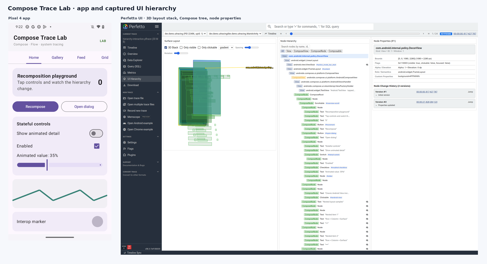

# Compose Trace Lab

A runnable Compose teaching app and a real Perfetto UI hierarchy capture setup. The tutorial starts from Java, XML layouts, and Android Views, then explains Compose, Kotlin state, coroutines and Flow while showing how to correlate those concepts with a trace.

## Why the hierarchy trace is useful

The captured trace was produced by the app with the AndroidX Compose hooks and matching Perfetto UI. In a 60-second interactive session, it recorded 126 snapshots across windows and 101 frames for the app's main window. It contains 8,950 composable calls, 3,319 scope events, 860 scope invalidations, 3,244 state reads, 1,716 state writes, 1,878 state changes, 622 animation frames, and 21 scroll events. The recomposition-cause table attributed a changed integer state to `TraceLab` in `MainActivity.kt`. This is enough to follow “what state changed, which scopes ran, and what UI tree was present?” alongside the regular frame and scheduler timeline.

This does not prove that recomposition caused a slow frame. Use FrameTimeline and scheduler tracks to establish whether a frame was late and what work was running. `include_everything` produces high-volume diagnostic data: the broad sample was 37 MB. Use a short, focused recording for debugging, and use a benchmark harness for performance numbers.

## Start here

1. Read **[The Compose and tracing tutorial](docs/TUTORIAL.md)**. It explains the screens and tracing concepts from a Views/XML starting point.
2. Follow **[the full setup and rebuild guide](docs/SETUP.md)** to check out the matching Perfetto branch and AndroidX change, build the actual hierarchy-enabled APK, run its instrumented journey, capture, and open the trace.
3. Use [`scripts/capture_trace.sh`](scripts/capture_trace.sh) after installing the hierarchy-enabled app. It encodes the config with the matching branch `protoc` before sending it to the device.

## What the app teaches

- Seven screens: Home, Gallery, Feed, Grid, Forms, Motion, and Flow.
- Compose: state and recomposition, modifier order, semantics/accessibility, lazy lists and grids, dialogs, animation, Canvas, text input, Material components, and an Android `TextView` embedded with `AndroidView`.
- Kotlin: `remember`, state ownership, lifecycle-aware `StateFlow`, transient `SharedFlow` events, cold flows, `flowOn`, coroutine scopes, and suspending delay.
- Tracing: Compose hierarchy snapshots and causal events beside Android frame timing and scheduling.

The instrumentation journey exercises all seven screens and checks UI results. It is a repeatable interaction workload, not a benchmark. See the setup guide for the exact AndroidX harness command; the standard app build is a non-tracing fallback and does not include the historical Compose hooks.

## Captures and device coverage

The real hierarchy screenshot is [`perfetto-ui-hierarchy.png`](docs/images/perfetto-ui-hierarchy.png); the companion timing view is [`perfetto-timeline.png`](docs/images/perfetto-timeline.png). Screenshots are full-size, uncropped captures. The tested Pixel 4/Pixel 4 XL devices ran Android 13/API 33. Their system Perfetto exposes app FrameTimeline/ftrace data; this hierarchy setup works by using the matching app-side Perfetto producer/AARs and source-built viewer.

Winscope ViewCapture, SurfaceFlinger layer-stack/3D, and synchronized video sources are separate, device/build-dependent capabilities. See the tutorial for how to check source registration and what each view can establish; this lab does not label a process timeline as a Winscope layer stack.

## Repository map

- [`app/src/main/java/dev/demo/uitracing/MainActivity.kt`](app/src/main/java/dev/demo/uitracing/MainActivity.kt): app entry point and Compose examples.
- [`app/src/androidTest/java/dev/demo/uitracing/TraceLabE2ETest.kt`](app/src/androidTest/java/dev/demo/uitracing/TraceLabE2ETest.kt): end-to-end interaction journey.
- [`trace_config_available_sources.textproto`](trace_config_available_sources.textproto): full hierarchy and system trace config.
- [`androidx-harness/`](androidx-harness): local build harness that compiles the CL-patched Compose sources.
- [`docs/images/`](docs/images/): app and Perfetto screenshots.
