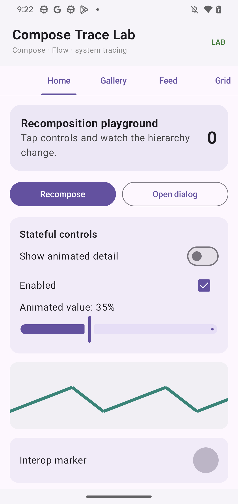
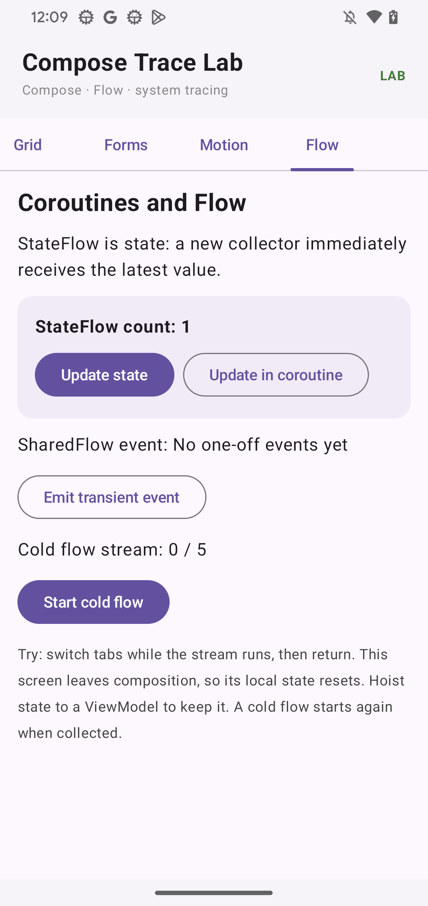

# Screenshot gallery

These are full-resolution PNG screenshots made from the Pixel 4 app and the local Perfetto development UI. Device screenshots are 1080×2280; viewer captures are 2000×1300. They are not cropped. The two-pane showcase and seven screen comparisons are scaled to fit, while their component source captures remain full size.

The set contains 121 images: 27 app states, seven screen-matched Perfetto hierarchy views, 42 hierarchy snapshots (21 timestamps in both 2D and 3D), 35 selected-node views, seven side-by-side app/Perfetto comparisons, one timing timeline, and two overview images. Snapshot pairs show the same scrubbed timestamp in the two display modes. Node captures show different selections in the viewer tree and properties pane. The [per-screen comparisons](SCREEN_COMPARISONS.md) explain how the seven paired states were selected and what to look for in each viewer pane.

## App states

- [app-feed-scroll.png](images/app-feed-scroll.png)
- [app-feed.png](images/app-feed.png)
- [app-flow-active.png](images/app-flow-active.png)
- [app-flow-coroutine.png](images/app-flow-coroutine.png)
- [app-flow.png](images/app-flow.png)
- [app-forms-expanded.png](images/app-forms-expanded.png)
- [app-forms-menu.png](images/app-forms-menu.png)
- [app-forms-radio.png](images/app-forms-radio.png)
- [app-forms-submit.png](images/app-forms-submit.png)
- [app-forms-typed.png](images/app-forms-typed.png)
- [app-forms.png](images/app-forms.png)
- [app-gallery-lower.png](images/app-gallery-lower.png)
- [app-gallery.png](images/app-gallery.png)
- [app-grid-scroll.png](images/app-grid-scroll.png)
- [app-grid.png](images/app-grid.png)
- [app-home-count10.png](images/app-home-count10.png)
- [app-home-dialog.png](images/app-home-dialog.png)
- [app-home-expanded.png](images/app-home-expanded.png)
- [app-motion.png](images/app-motion.png)
- [app-overview.png](images/app-overview.png)

Representative device screens:

## Matched app screens and hierarchy snapshots

Each comparison uses the screen title captured in the Compose tree and selects that title node in Perfetto. Pair sources are also linked at full resolution in the [comparison tutorial](SCREEN_COMPARISONS.md).

- [Home · snapshot 1](images/screen-pairs/home.png) ([phone source](images/matched/app-home.png), [Perfetto source](images/matched/perfetto-home.png))
- [Gallery · snapshot 26](images/screen-pairs/gallery.png) ([phone source](images/matched/app-gallery.png), [Perfetto source](images/matched/perfetto-gallery.png))
- [Feed · snapshot 32](images/screen-pairs/feed.png) ([phone source](images/matched/app-feed.png), [Perfetto source](images/matched/perfetto-feed.png))
- [Grid · snapshot 39](images/screen-pairs/grid.png) ([phone source](images/matched/app-grid.png), [Perfetto source](images/matched/perfetto-grid.png))
- [Forms · snapshot 44](images/screen-pairs/forms.png) ([phone source](images/matched/app-forms.png), [Perfetto source](images/matched/perfetto-forms.png))
- [Motion · snapshot 53](images/screen-pairs/motion.png) ([phone source](images/matched/app-motion.png), [Perfetto source](images/matched/perfetto-motion.png))
- [Flow · snapshot 61](images/screen-pairs/flow.png) ([phone source](images/matched/app-flow.png), [Perfetto source](images/matched/perfetto-flow.png))

## UI hierarchy snapshot scrubber

Open either image at full resolution to inspect the tree and snapshot state. Each 2D/3D pair uses the same snapshot index.

| Snapshot | 2D layout | 3D stack |
|---:|---|---|
| 1 | [2D](images/perfetto-snapshots/snapshot-01-2d.png) | [3D](images/perfetto-snapshots/snapshot-01-3d.png) |
| 2 | [2D](images/perfetto-snapshots/snapshot-02-2d.png) | [3D](images/perfetto-snapshots/snapshot-02-3d.png) |
| 3 | [2D](images/perfetto-snapshots/snapshot-03-2d.png) | [3D](images/perfetto-snapshots/snapshot-03-3d.png) |
| 4 | [2D](images/perfetto-snapshots/snapshot-04-2d.png) | [3D](images/perfetto-snapshots/snapshot-04-3d.png) |
| 5 | [2D](images/perfetto-snapshots/snapshot-05-2d.png) | [3D](images/perfetto-snapshots/snapshot-05-3d.png) |
| 6 | [2D](images/perfetto-snapshots/snapshot-06-2d.png) | [3D](images/perfetto-snapshots/snapshot-06-3d.png) |
| 7 | [2D](images/perfetto-snapshots/snapshot-07-2d.png) | [3D](images/perfetto-snapshots/snapshot-07-3d.png) |
| 8 | [2D](images/perfetto-snapshots/snapshot-08-2d.png) | [3D](images/perfetto-snapshots/snapshot-08-3d.png) |
| 9 | [2D](images/perfetto-snapshots/snapshot-09-2d.png) | [3D](images/perfetto-snapshots/snapshot-09-3d.png) |
| 10 | [2D](images/perfetto-snapshots/snapshot-10-2d.png) | [3D](images/perfetto-snapshots/snapshot-10-3d.png) |
| 11 | [2D](images/perfetto-snapshots/snapshot-11-2d.png) | [3D](images/perfetto-snapshots/snapshot-11-3d.png) |
| 12 | [2D](images/perfetto-snapshots/snapshot-12-2d.png) | [3D](images/perfetto-snapshots/snapshot-12-3d.png) |
| 13 | [2D](images/perfetto-snapshots/snapshot-13-2d.png) | [3D](images/perfetto-snapshots/snapshot-13-3d.png) |
| 14 | [2D](images/perfetto-snapshots/snapshot-14-2d.png) | [3D](images/perfetto-snapshots/snapshot-14-3d.png) |
| 15 | [2D](images/perfetto-snapshots/snapshot-15-2d.png) | [3D](images/perfetto-snapshots/snapshot-15-3d.png) |
| 16 | [2D](images/perfetto-snapshots/snapshot-16-2d.png) | [3D](images/perfetto-snapshots/snapshot-16-3d.png) |
| 17 | [2D](images/perfetto-snapshots/snapshot-17-2d.png) | [3D](images/perfetto-snapshots/snapshot-17-3d.png) |
| 18 | [2D](images/perfetto-snapshots/snapshot-18-2d.png) | [3D](images/perfetto-snapshots/snapshot-18-3d.png) |
| 19 | [2D](images/perfetto-snapshots/snapshot-19-2d.png) | [3D](images/perfetto-snapshots/snapshot-19-3d.png) |
| 20 | [2D](images/perfetto-snapshots/snapshot-20-2d.png) | [3D](images/perfetto-snapshots/snapshot-20-3d.png) |
| 21 | [2D](images/perfetto-snapshots/snapshot-21-2d.png) | [3D](images/perfetto-snapshots/snapshot-21-3d.png) |

## Node tree and properties selections

Each image shows a selected row and the corresponding viewer state. These are clickable full-resolution captures.

- [node-01.png](images/perfetto-nodes/node-01.png)
- [node-02.png](images/perfetto-nodes/node-02.png)
- [node-03.png](images/perfetto-nodes/node-03.png)
- [node-04.png](images/perfetto-nodes/node-04.png)
- [node-05.png](images/perfetto-nodes/node-05.png)
- [node-06.png](images/perfetto-nodes/node-06.png)
- [node-07.png](images/perfetto-nodes/node-07.png)
- [node-08.png](images/perfetto-nodes/node-08.png)
- [node-09.png](images/perfetto-nodes/node-09.png)
- [node-10.png](images/perfetto-nodes/node-10.png)
- [node-11.png](images/perfetto-nodes/node-11.png)
- [node-12.png](images/perfetto-nodes/node-12.png)
- [node-13.png](images/perfetto-nodes/node-13.png)
- [node-14.png](images/perfetto-nodes/node-14.png)
- [node-15.png](images/perfetto-nodes/node-15.png)
- [node-16.png](images/perfetto-nodes/node-16.png)
- [node-17.png](images/perfetto-nodes/node-17.png)
- [node-18.png](images/perfetto-nodes/node-18.png)
- [node-19.png](images/perfetto-nodes/node-19.png)
- [node-20.png](images/perfetto-nodes/node-20.png)
- [node-21.png](images/perfetto-nodes/node-21.png)
- [node-22.png](images/perfetto-nodes/node-22.png)
- [node-23.png](images/perfetto-nodes/node-23.png)
- [node-24.png](images/perfetto-nodes/node-24.png)
- [node-25.png](images/perfetto-nodes/node-25.png)
- [node-26.png](images/perfetto-nodes/node-26.png)
- [node-27.png](images/perfetto-nodes/node-27.png)
- [node-28.png](images/perfetto-nodes/node-28.png)
- [node-29.png](images/perfetto-nodes/node-29.png)
- [node-30.png](images/perfetto-nodes/node-30.png)
- [node-31.png](images/perfetto-nodes/node-31.png)
- [node-32.png](images/perfetto-nodes/node-32.png)
- [node-33.png](images/perfetto-nodes/node-33.png)
- [node-34.png](images/perfetto-nodes/node-34.png)
- [node-35.png](images/perfetto-nodes/node-35.png)

## Timeline and comparison

- [Perfetto timing and scheduler timeline](images/perfetto-timeline.png)
- [Phone app beside the Perfetto hierarchy viewer](images/showcase.png)

The hierarchy pages help answer what Compose nodes and state were present around an interaction. They do not prove that a recomposition caused a late frame; correlate the same moment with FrameTimeline and scheduler tracks. See the [tutorial](TUTORIAL.md) and [setup/rebuild guide](SETUP.md) for capture details and limits.
