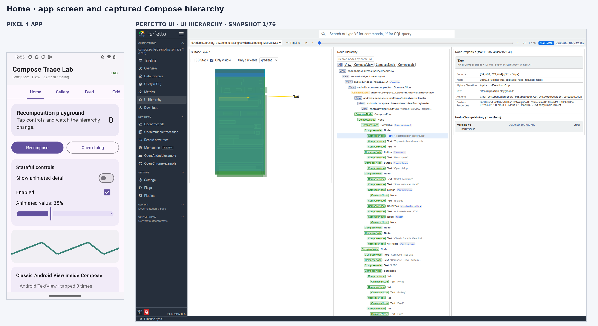
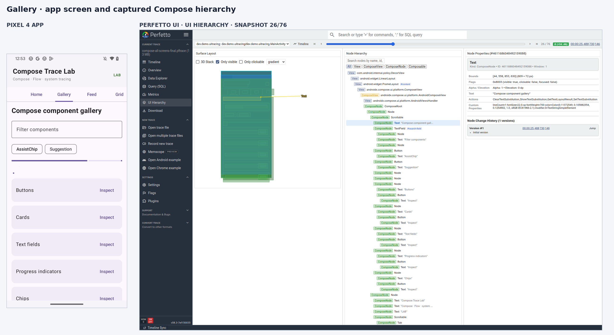
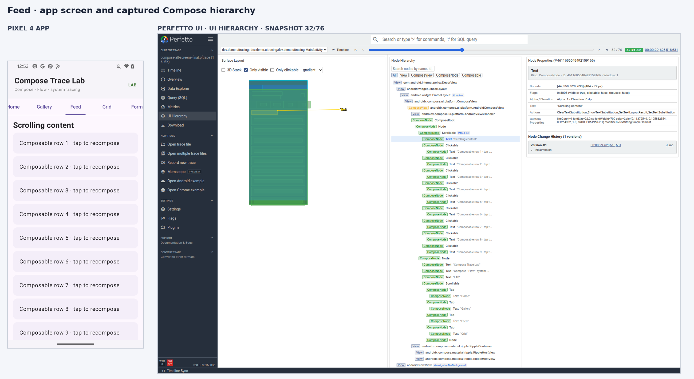
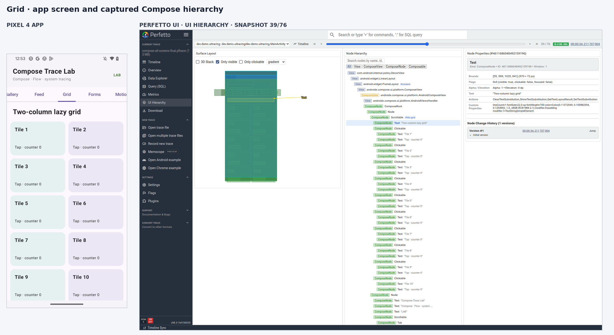
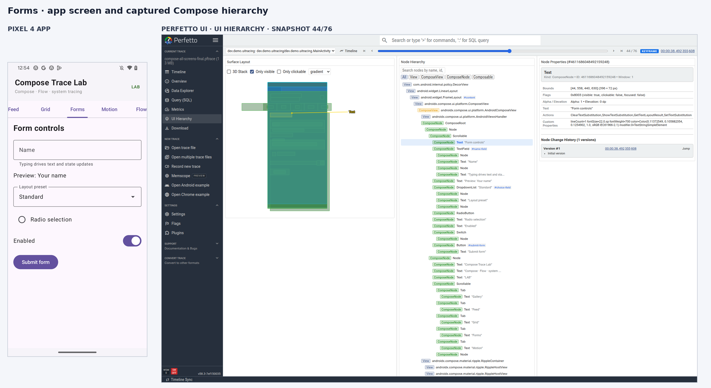
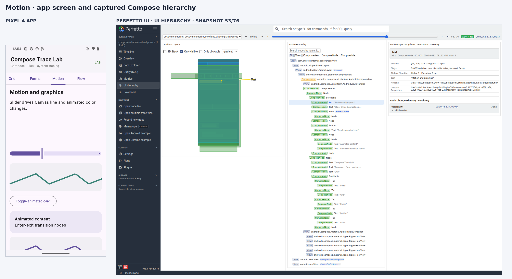
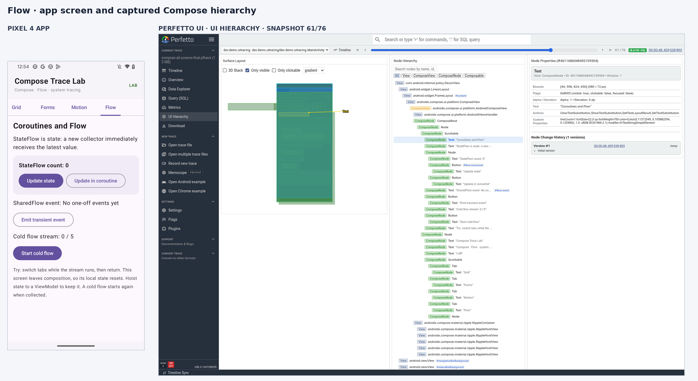

# Compose screens beside their Perfetto hierarchy

These seven comparisons pair each Trace Lab screen with the matching Compose UI hierarchy in the local Perfetto branch viewer. They all come from one Pixel 4 / Android 13 screen-tour trace. We switched to each tab while recording, found the snapshot where that screen's title entered the captured node tree, and selected that title in the Perfetto tree. The trace produced 76 hierarchy snapshots. The screenshot labels give each chosen snapshot index.

The app capture is on the left; the corresponding UI Hierarchy view is on the right. In each viewer capture, **3D Stack** is off and **Only visible** is on so bounds line up with the phone viewport. The heading `ComposeNode` is selected, so the right-hand properties panel shows the same screen title visible on the phone. The app and Perfetto captures show the same stable screen state, but they are separate screenshots rather than synchronized video frames.

## How to read a pair

1. Find the screen title and a distinctive element in the phone capture.
2. Find those labels in the Perfetto **Node Hierarchy** tree. The selected row is the matching title node.
3. Read its bounds, semantics, actions, and custom properties in **Node Properties**. Look at the green/blue outlines in **Surface Layout** to see where the selected node and its containing UI sit in the window.
4. Turn **3D Stack** on and rotate the view to separate nested nodes. Turn it off again to compare 2D bounds directly. Clear **Only visible** to reveal scroll content beyond the current viewport.

These screens illustrate node structure and captured properties. Use the timestamp in the viewer to jump to the same point in the regular timeline for frame timing and scheduling; the hierarchy alone does not establish that a composable caused a slow frame.

## Home — snapshot 1 of 76



Raw captures: [full-size app screen](images/matched/app-home.png) · [full-size Perfetto view](images/matched/perfetto-home.png)

Home shows the scrollable recomposition demo, state controls, Canvas chart, and embedded Android `TextView`. Its Perfetto tree includes both Compose nodes and the Android View interop subtree.

## Gallery — snapshot 26 of 76



Raw captures: [full-size app screen](images/matched/app-gallery.png) · [full-size Perfetto view](images/matched/perfetto-gallery.png)

The tree exposes the gallery heading, filter text field, Material chips, and repeated component categories.

## Feed — snapshot 32 of 76



Raw captures: [full-size app screen](images/matched/app-feed.png) · [full-size Perfetto view](images/matched/perfetto-feed.png)

The `#feed-list` lazy list contains only its currently composed rows. The tree shows the visible row labels beneath the list heading.

## Grid — snapshot 39 of 76



Raw captures: [full-size app screen](images/matched/app-grid.png) · [full-size Perfetto view](images/matched/perfetto-grid.png)

The `#tile-grid` node contains the two-column layout and the visible tile nodes. Compare its tree with Feed to see the different lazy layout structure.

## Forms — snapshot 44 of 76



Raw captures: [full-size app screen](images/matched/app-forms.png) · [full-size Perfetto view](images/matched/perfetto-forms.png)

The tree includes the text field, dropdown, radio button, switch, and submit button. These semantics and actions are useful when checking accessible interaction structure as well as layout.

## Motion — snapshot 53 of 76



Raw captures: [full-size app screen](images/matched/app-motion.png) · [full-size Perfetto view](images/matched/perfetto-motion.png)

The tree records the chart slider and animated card structure. Scrub the timeline around this snapshot to inspect animation and frame events alongside the hierarchy.

## Flow — snapshot 61 of 76



Raw captures: [full-size app screen](images/matched/app-flow.png) · [full-size Perfetto view](images/matched/perfetto-flow.png)

The tree includes the StateFlow count, coroutine update button, SharedFlow event label, and cold-flow controls. The UI hierarchy captures UI and Compose events; it does not replace coroutine debugging tools or prove that a Flow emission caused a frame delay.

## Recreate the screen tour

Follow the source checkout and build steps in [SETUP.md](SETUP.md), install the harness APK, then capture with [`scripts/capture_trace.sh`](../scripts/capture_trace.sh). While the 60-second capture is active, visit Home, Gallery, Feed, Grid, Forms, Motion, and Flow in order and leave each visible briefly. Open the resulting trace in the local UI from the same Perfetto checkout and choose **UI Hierarchy**. Use the trace's tree and screen headings to find a snapshot for each page; snapshot indices vary between runs. For the checked-in screenshots, the exact captured file was `traces/compose-all-screens-final.pftrace` and is intentionally left out of the public repo.

To locate the snapshots from SQL instead of scrubbing manually, open **Query (SQL)** in the matching local viewer and run this query. It finds the nearest snapshot to each heading node version; the ordered index is the slider's 1-based snapshot number:

```sql
INCLUDE PERFETTO MODULE android.ui_hierarchy;

WITH app_snapshots AS (
  SELECT
    id,
    ts,
    row_number() OVER (ORDER BY ts) AS snapshot_index
  FROM android_ui_hierarchy_snapshot
  WHERE upid = (
    SELECT upid FROM process WHERE name = 'dev.demo.uitracing' LIMIT 1
  )
), screen_headings AS (
  SELECT text, ts
  FROM android_ui_hierarchy_node
  WHERE upid = (
    SELECT upid FROM process WHERE name = 'dev.demo.uitracing' LIMIT 1
  )
    AND text IN (
      'Recomposition playground', 'Compose component gallery',
      'Scrolling content', 'Two-column lazy grid', 'Form controls',
      'Motion and graphics', 'Coroutines and Flow'
    )
)
SELECT
  heading.text,
  snapshot.snapshot_index,
  snapshot.ts AS snapshot_ts
FROM screen_headings AS heading
JOIN app_snapshots AS snapshot
  ON snapshot.id = (
    SELECT candidate.id
    FROM app_snapshots AS candidate
    ORDER BY abs(heading.ts - candidate.ts)
    LIMIT 1
  )
ORDER BY heading.ts;
```

For each result, move the hierarchy scrubber to `snapshot_index`, then select that page's heading node in the tree. To make a comparison like the screenshots here, turn off **3D Stack**, turn on **Only visible**, keep the app window selected, and screenshot the full viewer. Keep the original phone and viewer screenshots at full resolution; scale them only in the side-by-side comparison image.
