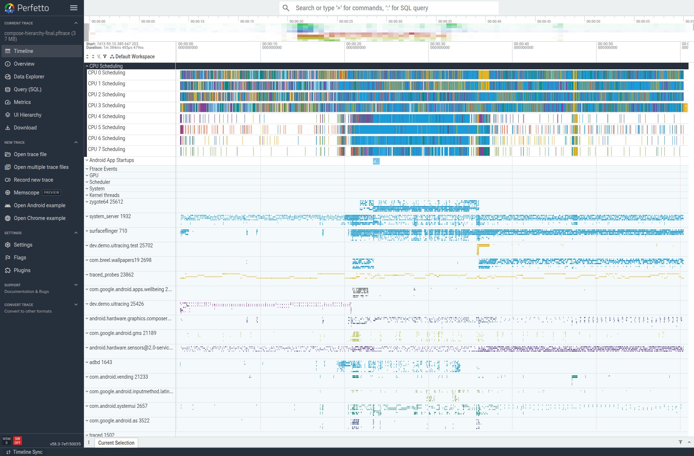
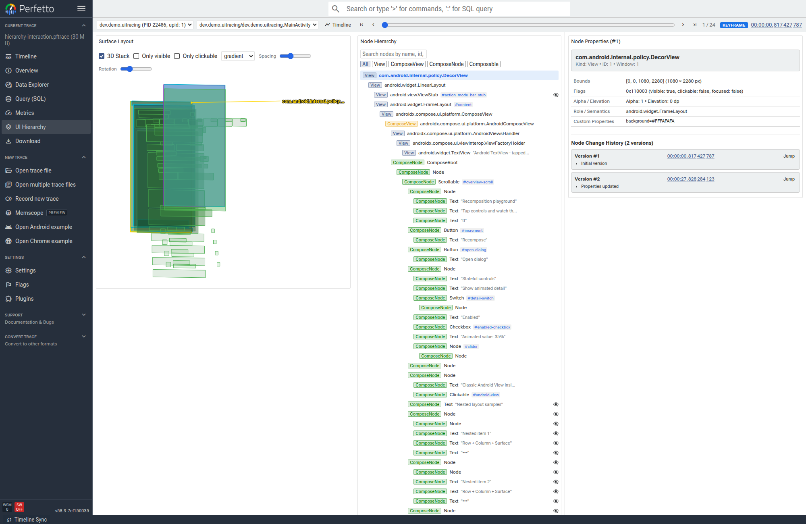

# Learn Compose and trace it with Perfetto

This guide is for an Android developer who knows Java, XML layouts, and Views. It starts with those ideas and builds toward Compose hierarchy tracing. You do not need React, Flutter, or another declarative UI framework to follow it.

## 1. What this repo does

Compose Trace Lab is an ordinary Android app with an `Activity`. Its UI has seven screens and intentionally changes while you use it: buttons update state, a list scrolls, text fields accept input, content animates, and a dialog appears in its own window.

That makes it useful for two related jobs:

1. **Learn Compose/Kotlin:** follow the app screens and source.
2. **Learn tracing:** perform a known action, capture what the app and system did, then inspect the matching point in time.

The app is not itself a profiler. It creates repeatable UI activity so traces are easier to learn and compare.

## 2. Java/XML ideas in Compose

Compose is Android's Kotlin UI toolkit. This project still launches an Android `Activity`; `setContent { ... }` is where the Compose tree is built. There is no XML layout to inflate for the screens below.

| Android Views / XML concept | Compose equivalent here |
|---|---|
| Inflate a layout in `onCreate` | `setContent { TraceLab() }` |
| `LinearLayout` vertical/horizontal | `Column { ... }` / `Row { ... }` |
| A view's UI declaration | A function annotated `@Composable`, such as `Overview(...)` (it describes UI; it is not a retained `View` object) |
| XML width, padding, click listener | A `Modifier` chain such as `.fillMaxWidth().padding(16.dp).clickable { ... }` |
| Change a view and call `invalidate()` | Change observed Compose state; Compose recomputes the affected UI |
| `RecyclerView` adapter | `LazyColumn` / `LazyVerticalGrid` item content |
| View visibility toggle | `if (...) { ... }` or `AnimatedVisibility(...)` |
| View content description | `Modifier.semantics { contentDescription = ... }` |

A composable function is a description of UI, not a `View` object you keep and mutate. Compose's runtime still maintains UI nodes and their state; it calls composables to create or update that runtime-managed tree. When state read by a composable changes, Compose can run the relevant part again; this is **recomposition**. It can skip work when inputs have not changed. Recomposition does not automatically mean a frame was drawn or that the screen changed visibly.

A `Modifier` is a chain of layout, drawing, interaction, and accessibility behavior attached to a composable. It is not CSS. Order can matter: for example, padding before a background paints a different area than padding after it.

### Compose trade-offs compared with Views/XML

Compose removes much of the manual view lookup, adapter, and `invalidate()` plumbing. UI can be expressed next to its state, repeated content is concise, and animation/layout APIs compose well together. It is still Kotlin code and Android UI: you still need to understand lifecycle, state ownership, accessibility, layout, drawing, and threading.

The main trade-offs for a Views developer are:

- **New mental model:** describe the UI for the current state rather than keeping a tree of objects and mutating each widget. Recomposition is expected; it is not itself evidence of a performance bug.
- **State ownership matters:** `remember` lasts only while that composable stays in the composition. Navigation, lifecycle, and configuration changes determine whether local state is recreated. Put durable screen/app state in an appropriate owner such as a `ViewModel`.
- **Interop is possible, but has boundaries:** `AndroidView` embeds an existing `View`, shown on Home. It is useful during migration, but a View's internal child tree is not the same thing as Compose nodes. Custom View focus, nested scrolling, accessibility, and tracing each need checking.
- **Tooling differs:** Compose tests query semantics/test tags rather than relying only on resource IDs. Layout Inspector and Compose-specific tracing can show structure; system traces answer timing/scheduling questions.
- **Performance needs measurement:** declarative code does not guarantee fewer allocations or faster frames. Stable keys, state placement, lazy layouts, and expensive work still matter. Compare a repeatable trace/benchmark instead of optimizing because a recomposition occurred.

This lab intentionally puts an actual `TextView` inside `AndroidViewCard()` so you can compare Compose content with a classic Android view. It does not imply that all legacy Views must be rewritten before using Compose.

### A small Kotlin bridge before reading the app

You do not need to know Kotlin already, but a few syntax differences make the source easier to read:

- `val name = "Home"` declares a read-only reference; `var count = 0` declares a reassignable one. A `val` reference can still point to a mutable object.
- Kotlin declares a function with `fun increment() { ... }`; its return type follows the parameter list (`fun doubled(value: Int): Int = value * 2`). `@Composable` is an annotation, like a Java annotation, that marks a function for use inside Compose UI composition. In string templates, `"Count: $count"` inserts the value, much like Java concatenation.
- `{ ... }` is a lambda, roughly like a small anonymous function. `Button(onClick = { count++ })` passes one as the click callback. When the last parameter is a lambda, Kotlin lets it move outside the parentheses: `Button { Text("OK") }` is the same trailing-lambda style. Compose uses nested lambdas to describe children.
- In `items(rows) { row -> Text(row) }`, `row` names the lambda argument. If the argument is omitted, Kotlin's implicit name `it` is available: `{ Text(it) }`.
- `Column { ... }` is a composable DSL block: its lambda has a `ColumnScope` receiver, which provides column-specific child helpers. Read it as “declare these children inside this column”; it does not create a Java-style `Column` variable that you later mutate.
- `by` delegates property reads and writes to another object. In `var count by remember { mutableIntStateOf(0) }`, `count` reads/writes the Compose state holder's value; `remember` keeps that holder for this composable's current stay in the composition.

Here is the Home counter's path through the code. [`TraceLab()`](../app/src/main/java/dev/demo/uitracing/MainActivity.kt#L82) creates `counter` as Compose state and passes `{ counter++ }` as the `increment` callback to [`Overview()`](../app/src/main/java/dev/demo/uitracing/MainActivity.kt#L207):

```kotlin
var counter by remember { mutableIntStateOf(0) }
```

Inside Overview, [`Button(onClick = increment)`](../app/src/main/java/dev/demo/uitracing/MainActivity.kt#L221) invokes that callback after a tap. `counter++` writes a new value to the state holder. Compose has recorded that Overview read the value, so it schedules the affected UI to be recomposed; the `Text("$counter")` at [MainActivity.kt:218](../app/src/main/java/dev/demo/uitracing/MainActivity.kt#L218) then reads the current value and displays it. This resembles changing a model and refreshing a View, but there is no manual `findViewById()` or `setText()` call. Recomposition means Compose re-evaluates the relevant UI description; it does not guarantee that a new frame was drawn.

Start at `app/src/main/java/dev/demo/uitracing/MainActivity.kt`:

1. `MainActivity.onCreate()` calls `setContent`.
2. `TraceLab()` owns screen selection and shared demo state.
3. `Overview`, `Components`, `FormsScreen`, `MotionScreen`, and `FlowScreen` build the pages.
4. `LazyColumn` and `LazyVerticalGrid` compose visible rows/tiles and may keep a small beyond-viewport window for prefetch or reuse; they do not eagerly compose the whole 100-row/60-tile data set.

Try the Home page's **Recompose** button. The counter changes because Compose state changes, not because the app manually finds a `TextView` and assigns text. Open the dialog, turn on animated detail, then move the slider. Each action gives the trace a different interaction to correlate with events and snapshots.

## 3. State and lifecycle: where Java developers often pause

`remember { mutableStateOf(...) }` is a small state holder associated with the current composition. It is convenient for this demo screen. If the composable leaves the composition, its remembered state goes away. `rememberSaveable` can restore supported small UI values across configuration changes and Android recreation when saved state is available; it is not durable storage, and it does not automatically preserve a value when this app removes a tab's composable from the composition. A `ViewModel` can retain screen state across configuration changes, while navigation/state-saving or persistent storage is needed for other lifetimes. Choose the owner based on how long the value should live.

Do not use an ordinary local variable for a value that should redraw the screen:

```kotlin
var count = 0 // ordinary local value; Compose does not observe assignments
```

Use observable state instead:

```kotlin
var count by remember { mutableIntStateOf(0) }
Button(onClick = { count++ }) { Text("Count: $count") }
```

The key idea is **observable state drives UI**. This is similar in intent to updating a View model and then binding/re-rendering, but Compose handles tracking the UI reads and updating the tree.

## 4. Kotlin coroutines and Flow, using the Flow screen

A coroutine is a task that can suspend and resume without blocking a thread while it waits. It is not a new thread by default. `delay(250)` suspends the coroutine; it does not sleep/block the UI thread. `rememberCoroutineScope()` gives this screen a scope whose work is cancelled when that composition leaves. For longer-lived app work, a `ViewModel` commonly uses `viewModelScope`.

Flow has a few forms with different jobs:

- **`StateFlow<T>`:** current state. It always has a current value; a new collector gets the latest state. On the Flow page, tap **Update state** and see the displayed count change.
- **`SharedFlow<T>`:** a configurable broadcast stream. This demo configures one with no replay and uses it for a transient event message; an event emitted with no active collector is not replayed later.
- **Cold `flow { ... }`:** work starts when a collector collects it. On the Flow page, tap **Start cold flow**. The sequence emits five values with a short suspension between them.
- **`flowOn(Dispatchers.Default)`:** changes the coroutine context for work upstream of `flowOn` (here, the `flow { ... }` builder). It does not move the downstream `collect` callback: that runs in the context of the coroutine started by the button handler, which is the UI scope here. So `streamProgress = it` updates Compose state from that collector. This tiny demo uses `Default` to show the boundary; it is not a recommendation to move every flow there.
- **`collectAsStateWithLifecycle()`:** adapts a `StateFlow` to Compose state and stops UI collection when the Android lifecycle is not active.

In Java terms, a `Flow` is not simply a `List` or a `Future`: it is an asynchronous stream that can emit over time. A `StateFlow` is the state-holder variant; a `SharedFlow` is a configurable hot stream. Structured coroutine scopes define who owns cancellation. To follow the actual path in [`FlowScreen()`](../app/src/main/java/dev/demo/uitracing/MainActivity.kt#L137), start at **Start cold flow** ([lines 160–166](../app/src/main/java/dev/demo/uitracing/MainActivity.kt#L160)): the click launches a coroutine, the cold builder emits five numbers with `delay`, `flowOn` selects the upstream context, and `collect` writes each number into `streamProgress`, which the screen displays at line 159. The **Update state** button updates the `MutableStateFlow`; `collectAsStateWithLifecycle()` exposes its latest value to Compose. The event button calls `tryEmit`, and the `LaunchedEffect` collector displays received events.

In this sample the `MutableStateFlow`, event stream, and stream progress are created with `remember` or local Compose state inside `FlowScreen`. `TraceLab` uses `when` to show only the selected tab's page ([lines 111–125](../app/src/main/java/dev/demo/uitracing/MainActivity.kt#L111)); switching away removes `FlowScreen` from the composition. Its remembered values are discarded, its `LaunchedEffect` collector is cancelled, and work launched in its `rememberCoroutineScope` is cancelled too. Returning creates fresh state; tapping **Start cold flow** then creates and collects a new cold flow. This is why the screen's prompt says to switch tabs while the stream runs. A ViewModel can own state/work for a longer screen or navigation lifetime:

```kotlin
class CounterViewModel : ViewModel() {
    private val _count = MutableStateFlow(0)
    val count = _count.asStateFlow()

    fun increment() { _count.update { it + 1 } }
}
```

This is a model sketch, not a paste-ready file: it needs imports for `ViewModel`, `MutableStateFlow`, `asStateFlow`, and `update`, plus the lifecycle ViewModel and coroutines dependencies. It also omits how the app obtains/provides the ViewModel (for example, with Compose's `viewModel()` helper or dependency injection). `viewModelScope` is useful when launching coroutines from the ViewModel; this small example does not launch any work there.

Then collect `viewModel.count` with `collectAsStateWithLifecycle()` from the screen. State ownership and collection lifetime are separate choices: the ViewModel can keep the value while the screen stops collecting it. A ViewModel survives configuration change, but not arbitrary process death without saved or persistent state.

## 5. What each screen adds to a trace

| Screen | Try this | Useful things to correlate |
|---|---|---|
| **Home** | Tap Recompose 10 times, toggle animated detail, drag slider, open/close dialog | State changes, animation frames, input dispatch, separate dialog window |
| **Gallery** | Type “Canvas” in the filter | IME/input, text changes, list filtering, resulting layout |
| **Feed** | Flick-scroll through the 100 rows and tap a row | Lazy item creation, scroll frames, input handling |
| **Grid** | Scroll and tap tiles in the 60-item grid | Lazy grid composition/layout compared with the list |
| **Forms** | Edit Name, open the dropdown, toggle controls, submit | Focus, keyboard, popup/menu window, text and state updates |
| **Motion** | Drag slider and toggle animated card | Repeated state updates, animation, drawing, frame timing |
| **Flow** | Start cold flow, update state/event, switch away and back | Coroutine emissions, state lifetime, lifecycle-aware collection |

Each image is a full device capture with no crop. Open any screenshot at full resolution:

- [Home: state, animation, Canvas, and AndroidView](images/app-overview.png)
- [Home: dialog as a separate window](images/app-home-dialog.png)
- [Gallery: Material components and filtering](images/app-gallery.png)
- [Gallery: lower component categories](images/app-gallery-lower.png)
- [Feed: lazy list](images/app-feed.png)
- [Feed: after scrolling](images/app-feed-scroll.png)
- [Grid: lazy grid](images/app-grid.png)
- [Grid: later tiles after scrolling](images/app-grid-scroll.png)
- [Forms: text, selection, and switches](images/app-forms.png)
- [Forms: keyboard and live text update](images/app-forms-typed.png)
- [Forms: exposed layout preset menu](images/app-forms-menu.png)
- [Forms: expanded layout preset](images/app-forms-expanded.png)
- [Forms: selected radio option](images/app-forms-radio.png)
- [Forms: submitted result](images/app-forms-submit.png)
- [Motion: slider, Canvas, and animated visibility](images/app-motion.png)
- [Home: counter after repeated state updates](images/app-home-count10.png)
- [Home: animated content expanded](images/app-home-expanded.png)
- [Flow: StateFlow, SharedFlow, and cold flow](images/app-flow.png)
- [Flow: changed state, one-off event, completed cold flow](images/app-flow-active.png)
- [Flow: coroutine controls](images/app-flow-coroutine.png)
- [Perfetto: UI hierarchy, 3D stack, and node inspection](images/perfetto-ui-hierarchy.png)
- [Perfetto: timing and scheduling timeline](images/perfetto-timeline.png)

The [complete screenshot gallery](IMAGE_GALLERY.md) includes 27 app states, seven matched app/Perfetto screen pairs, 21 hierarchy snapshots in both 2D and 3D, 35 node-property selections, and the timing/overview images. Raw captures are full resolution; the gallery links each one directly. The [screen comparison tutorial](SCREEN_COMPARISONS.md) pairs all seven app pages with their selected Compose title node and screenshot index.

## 6. Run the end-to-end interaction journey

Before these commands, follow [the SDK, JDK, and AndroidX harness setup](SETUP.md). The ordinary root Gradle app is a non-tracing fallback; use the AndroidX harness to run the tracing app.

Build/install and run the E2E test:

```sh
cd "$ANDROIDX_DIR"
ANDROID_SERIAL=YOUR_DEVICE_SERIAL ANDROID_HOME="$ANDROID_HOME" ANDROID_SDK_ROOT="$ANDROID_HOME" \
  ALLOW_PUBLIC_REPOS=1 ALLOW_MISSING_PROJECTS=1 PROJECT_PREFIX=:trace-lab-app \
  ./gradlew -PcomposeTraceLabDir="$LAB_DIR" :trace-lab-app:installDebug \
  :trace-lab-app:connectedDebugAndroidTest --no-daemon --dependency-verification=off
```

Replace `YOUR_DEVICE_SERIAL` with the serial shown by `adb devices -l`.

The [E2E test source](../app/src/androidTest/java/dev/demo/uitracing/TraceLabE2ETest.kt) shows the exact actions and visible assertions. It drives all seven screens: repeated state updates, animated visibility, dialog open/close, gallery filter entry, long-list and grid scrolling/taps, form entry, AndroidView interop, and Flow state/event work. It verifies UI outcomes; it does **not** measure performance because instrumentation affects timing. Run this functional check separately from `include_everything` tracing: the high-volume trace can make a device-side test time out.

## 7. Capture the real Compose hierarchy trace

Follow [the full setup guide](SETUP.md) first. It checks out and builds the matching historical Perfetto branch and AndroidX Gerrit change, compiles the Compose runtime/UI hooks, packages both AARs, and builds the tracing-enabled app. A normal Maven Compose build does not contain these hooks.

Install the harness-built APK, verify `Perfetto UI hierarchy tracing initialized` in `logcat`, and ensure `adb shell perfetto --query` lists `android.ui.hierarchy`. Then start the capture:

```sh
ANDROID_SERIAL=YOUR_DEVICE_SERIAL ./scripts/capture_trace.sh
```

The script encodes `trace_config_available_sources.textproto` with `perfetto-hierarchy/out/default/protoc` and pipes the binary config into the device's Perfetto service. This matters on the tested Android 13 devices: their system Perfetto v25 text parser does not know the newer `ui_hierarchy_config` fields, and its sandbox cannot read an arbitrary pushed config path directly. The 60-second config gives time to exercise the app. It writes `traces/compose-hierarchy.pftrace`; trace files are git-ignored because they can contain device/process details. Lower `duration_ms` for a focused recording.

The config includes:

- `android.ui.hierarchy`: all hierarchy, Compose, state, modifier, animation, input, layout, and runtime event categories supported by the CL.
- `linux.ftrace`: `gfx`, `view`, `input`, `wm`, `am` ATrace categories, the app package, and scheduler switch/wakeup events.
- `android.surfaceflinger.frame` and `android.surfaceflinger.frametimeline`.
- process and system statistics.

These sources answer different questions. ATrace and scheduler events show work and scheduling. FrameTimeline shows expected vs. actual app/display frames and jank when the OS emits it. The process rows identify app threads. A screenshot or hierarchy source is needed to identify UI structure; do not guess which composable is responsible from a timing chart alone.

## 8. Read the Perfetto timeline in a fixed order

Open the `.pftrace` in [Perfetto UI](https://ui.perfetto.dev): choose **Open trace file**. Then:

1. Find `dev.demo.uitracing` in the track list and expand it. Its threads (including `main thread` and render work) are below the process.
2. Find **Expected Timeline** and **Actual Timeline**. Select an Actual frame slice. Compare its time/duration with the expected window; inspect late/jank details when provided.
3. Locate the user action on the time ruler. For a scroll, compare frames before/during/after the gesture.
4. Inspect app main-thread/render-thread slices around a late frame. Check whether they were running, waiting, or not scheduled; use CPU Scheduling and ftrace scheduler tracks to distinguish these cases.
5. Inspect `gfx`, `view`, `input`, and window/activity events at the same time.
6. Form a narrow hypothesis and record again after changing one thing.

**Important:** a long frame says that the frame was late; it does not name the slow composable or prove that recomposition caused it. The hierarchy view provides node changes; the system trace provides timing and scheduling. Correlate timestamps before concluding.

The screenshot below is from the hierarchy-enabled app on the Pixel 4. The frame timeline and scheduler tracks answer when a frame landed and what threads did; the hierarchy viewer shown next answers what Compose nodes and state were present.



FrameTimeline is supported from Android 12 onward; see the [Perfetto FrameTimeline guide](https://android.googlesource.com/platform/external/perfetto/+/refs/heads/main/docs/data-sources/frametimeline.md) for expected/actual semantics and jank details. Source registration alone does not guarantee that a particular device/build emits usable events: inspect the resulting trace.

## 9. What the Compose hierarchy trace tells you

The matching Perfetto UI branch adds a **UI Hierarchy** page with a snapshot scrubber and three panes: 2D/3D surface layout, a searchable node tree, and node properties. The timeline also has hierarchy snapshots and Compose event tracks. Click a snapshot or state/recomposition event, then open the 3-pane viewer at that timestamp. The UI can show bounds, text/semantics, Compose node kinds/modifiers, event activity, and (when the packet data supports it) a likely state-related recomposition cause.



In the recorded 60-second interaction run, the trace contained **126 snapshots across windows** and 101 emitted/zero skipped frames for the app's main window. Its Compose event table contained 8,950 composable calls, 3,319 scope events, 860 invalidations, 3,244 state reads, 1,716 state writes, 1,878 state changes, 622 animation frames, and 21 scroll events. The recomposition-cause view attributed an integer state change to `TraceLab` in `MainActivity.kt`. This makes the trace useful for exploring which UI scopes were active around a known action and how state/tree details changed.

Treat those counts as evidence that the source is live, not as a quality score. The hierarchy packets are verbose; this capture was 37 MB. It does not prove that a recomposition caused a missed deadline. Inspect the same timestamp in FrameTimeline and scheduler tracks, then make and test a specific hypothesis. Prefer brief captures when iterating.

## 10. ViewCapture, Winscope, and video

| Source | Question it answers | Limit |
|---|---|---|
| Compose UI hierarchy | Which Compose nodes, bounds, text, and properties were captured at this timestamp? What state/scope events were recorded? | Requires the matching AndroidX app hooks and Perfetto UI branch. It does not establish thread scheduling or prove jank causality. |
| Winscope ViewCapture | What View hierarchy did a participating app/system window expose? | Device/build-dependent; it is not a list of composable function calls. |
| Winscope SurfaceFlinger + Window Manager | Which platform layers/windows were visible, positioned, focused, or transitioning? | Shows the platform composition, not Compose internals. |
| Perfetto FrameTimeline + ftrace | Was a frame late, and what were app/system threads doing? | Does not identify the responsible Compose node. |
| Screen recording | What did the user see during the issue? | Visual evidence only unless captured with synchronized trace metadata. A plain MP4 is not a Perfetto data source. |

These are complementary views. Align them to the same action/time before forming a hypothesis.

The Pixel 4 and Pixel 4 XL used here ran Android 13 (API 33). Their system source query exposed FrameTimeline and ftrace; it did not expose `android.surfaceflinger.layers` or a ViewCapture producer. `screenrecord --help` reported v1.3. The screenshots therefore show the app UI, Compose hierarchy viewer, and Perfetto timeline, but no Winscope 3D layer stack or synchronized video pane. Check another device/build before enabling optional sources:

```sh
adb shell perfetto --query
adb shell screenrecord --help
```

For a device that offers the Winscope targets, use [AOSP's capture guide](https://source.android.com/docs/core/graphics/winscope/capture/winscope) and open the resulting trace bundle in [Winscope](https://winscope.dev). Its 3D stack can show platform layer/window placement as it relates to the Compose tree and frame timing.

For the exact historical branch/CL checkout, setup, build, config transport, and troubleshooting, see [Rebuild the hierarchy capture setup](SETUP.md). The tracing API used by this CL is `UiHierarchyTracing.install(context)`; the older `init` snippet in the original capture guide does not match this checkout.

## 11. Kotlin/Compose lifecycle and source learning path

Read these in order:

1. `MainActivity.onCreate()` — ordinary Android entry point.
2. `TraceLab()` — screen routing and `Scaffold`.
3. `Overview()` — state, event handlers, and components.
4. `FormsScreen()` — form state, menu, controls.
5. `MotionScreen()` / `MiniChart()` — animation and Canvas drawing.
6. `FlowScreen()` — StateFlow, SharedFlow, and a cold flow.
7. `TraceLabE2ETest.kt` — how user actions are driven and verified.

Helpful experiments:

- Change the initial slider value and inspect whether the visual and state label agree.
- Add an item to the Gallery filter list and test typing.
- Change the cold flow's emission count/delay and observe when it runs.
- Tap Flow's event button before/after visiting another screen; distinguish the latest *state* from transient *events*.
- Add a new tab with a composable function, then add one E2E assertion for its visible content.
- Capture a trace before and after a change; compare the same interaction window.

## 12. Gaps and useful next improvements

This repo is a teaching and capture-validation tool, not a production benchmark suite. Known gaps:

- Generated historical CL AARs are not committed; `docs/SETUP.md` explains how to reproduce them. Future AndroidX/Perfetto revisions may change build requirements.
- No screenshot/video-backed E2E assertion; instrumentation verifies semantic UI outcomes only.
- Winscope ViewCapture, layer-stack/3D, and synchronized video depend on device support and are not included in the Pixel 4 capture.
- The app's examples use local screen state for clarity; a next lesson could move selected state into a `ViewModel`, add navigation/back-stack, and compare lifecycle/recomposition behavior.
- CI runs the E2E journey on an API 35 emulator; the documented physical Pixel run remains useful for device-specific behavior.
- The default 60-second trace collects everything and creates a large file. Reduce `duration_ms` in the config for focused exploration, and use release-like builds/benchmark tools for performance measurements.

When changing behavior, keep the capture config, device build details, reproduction steps, and screenshots together. A trace without a clearly described action is difficult to interpret.
